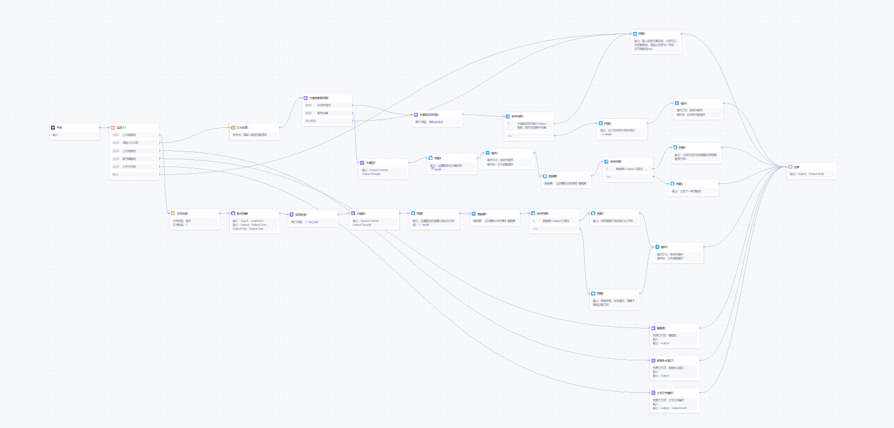

# ATRI 多模态智能问答助手

> 基于 **腾讯云智能体开发平台（元器 Yuanqi）** 工作流编排 + **Vue 3** 前端 + **Express** 后端的全栈多模态 AI 问答系统。
> 支持文本对话、图片识别、文件解析、视频/音频链接处理、联网搜索、表情包检索等多种交互方式，并内置 Live2D 看板娘与背景音乐播放器。

<p align="center">
  
</p>

---

## 目录

- [项目亮点](#项目亮点)
- [技术栈](#技术栈)
- [系统架构](#系统架构)
- [工作流运行流程](#工作流运行流程)
- [智能体核心能力](#智能体核心能力)
- [前端特性](#前端特性)
- [项目结构](#项目结构)
- [环境准备](#环境准备)
- [本地开发部署](#本地开发部署)
- [生产环境部署](#生产环境部署)
- [环境变量说明](#环境变量说明)
- [API 接口文档](#api-接口文档)
- [常见问题](#常见问题)
- [许可证](#许可证)

---

## 项目亮点

- **全链路自研** — 从智能体工作流设计到前后端实现，完整覆盖 AI 应用的全生命周期
- **多模态输入** — 同时支持纯文本、图片、文档文件、视频/音频链接等多种输入形式
- **流式输出** — 基于 SSE（Server-Sent Events）实现打字机效果的实时流式响应
- **用户体系** — 完整的注册/登录/JWT 鉴权/个人资料管理（头像、昵称）
- **Live2D 看板娘** — 集成 oh-my-live2d，内置多套模型（Kobayaxi、Miku、Sakula、Asuna）
- **背景音乐** — 内置胶囊式音乐播放器，支持播放列表切换
- **响应式设计** — 完美适配桌面端与移动端

---

## 技术栈

### 前端

| 技术 | 用途 |
|------|------|
| **Vue 3** (Composition API) | 核心 UI 框架 |
| **Vue Router 4** | 前端路由（登录页/聊天页） |
| **Vite 5** | 构建工具与开发服务器 |
| **Axios** | HTTP 请求（登录/注册/资料管理） |
| **Fetch API + SSE** | 流式聊天数据传输 |
| **oh-my-live2d** | Live2D 看板娘渲染 |
| **CSS3** | 毛玻璃特效、动画、Flexbox 响应式布局 |
| **Material Icons** | 图标库 |

### 后端

| 技术 | 用途 |
|------|------|
| **Node.js + Express** | Web 服务器框架 |
| **MySQL** (mysql2) | 用户数据持久化存储 |
| **JWT** (jsonwebtoken) | 无状态身份认证 |
| **bcryptjs** | 密码哈希加密 |
| **Multer** | 头像图片上传处理 |
| **CORS** | 跨域资源共享 |
| **TC3-HMAC-SHA256** | 腾讯云 API 签名认证 |

### 智能体平台（后端 AI 引擎）

| 组件 | 说明 |
|------|------|
| **腾讯元器（Yuanqi）** | 智能体开发与工作流编排平台 |
| **混元 hunyuan-pro** | 主推理模型（32K 上下文），负责复杂推理与内容生成 |
| **hunyuan-lite** | 辅助模型，用于轻量判断与意图分类 |
| **元器知识库** | 基于向量检索的领域知识存储与检索 |
| **联网搜索插件** | 实时互联网信息获取 |
| **表情包检索插件** | 语义化表情包推荐 |
| **上传文件解析插件** | 文档内容提取与分析 |

### 部署

| 平台/工具 | 用途 |
|-----------|------|
| **Railway** | 后端服务托管（含构建与启动配置） |
| **Vercel** | 前端静态资源托管（可选） |
| **自定义域名** | 支持绑定 `atrichat.top` 等自有域名 |

---

## 系统架构

```
┌─────────────────────────────────────────────────────────────┐
│                        客户端 (浏览器)                        │
│  ┌───────────┐  ┌──────────┐  ┌──────────┐  ┌───────────┐  │
│  │ LoginPanel│  │ ChatView │  │  Live2D  │  │MusicPlayer│  │
│  └─────┬─────┘  └────┬─────┘  └──────────┘  └───────────┘  │
│        │              │                                      │
│        │   Axios/Fetch (SSE)                                 │
└────────┼──────────────┼──────────────────────────────────────┘
         │              │
         ▼              ▼
┌─────────────────────────────────────────────────────────────┐
│                  Express 后端服务 (:3000)                     │
│  ┌──────────┐  ┌──────────────┐  ┌────────────────────┐     │
│  │ Auth API │  │  User API    │  │  Chat API (SSE)    │     │
│  │ 注册/登录 │  │ 资料/头像    │  │  流式/非流式聊天    │     │
│  └────┬─────┘  └──────┬───────┘  └─────────┬──────────┘     │
│       │               │                     │                │
│       ▼               ▼                     ▼                │
│  ┌─────────┐   ┌───────────┐   ┌───────────────────────┐    │
│  │  MySQL  │   │  文件存储   │   │  腾讯云 Yunzhi API    │    │
│  │ 用户表   │   │  头像上传   │   │  TC3 签名 → 智能体    │    │
│  └─────────┘   └───────────┘   └───────────┬───────────┘    │
└─────────────────────────────────────────────┼────────────────┘
                                              │
                                              ▼
                            ┌─────────────────────────────┐
                            │   腾讯元器智能体工作流引擎     │
                            │  (意图识别 → 知识检索 → 推理)  │
                            └─────────────────────────────┘
```

---

## 工作流运行流程

以下是腾讯元器平台上编排的智能体工作流核心逻辑：

<p align="center">
  
</p>

### 流程概览

```
用户输入
  │
  ▼
┌──────────┐
│ 意图分类  │ ← hunyuan-lite 轻量分类
└────┬─────┘
     │
     ├─── 纯文本问题 ──────────────────────────────────┐
     │                                                  ▼
     │                                        ┌──────────────────┐
     │                                        │ 大模型知识库查找   │
     │                                        │ (向量检索匹配)     │
     │                                        └────────┬─────────┘
     │                                                  │
     │                                        ┌─────────▼─────────┐
     │                                        │  条件判断：命中？   │
     │                                        └──┬──────────┬─────┘
     │                                     命中  │          │ 未命中
     │                                           ▼          ▼
     │                                   ┌──────────┐ ┌──────────┐
     │                                   │ LLM 问答 │ │ 联网搜索  │
     │                                   │ 知识增强  │ │ 兜底回答  │
     │                                   └────┬─────┘ └────┬─────┘
     │                                        │            │
     │                                        ▼            ▼
     │                                   ┌──────────────────────┐
     │                                   │ 循环迭代 (exit_flag)  │
     │                                   │ 多轮深入问答          │
     │                                   └──────────┬───────────┘
     │                                              │
     ├─── 上传图片 ─────┐                           │
     │                  ▼                           │
     │         ┌───────────────┐                    │
     │         │  文件处理      │                    │
     │         │  参数提取      │                    │
     │         │  (imgUrl 等)   │                    │
     │         └───────┬───────┘                    │
     │                 ▼                            │
     │         ┌───────────────┐                    │
     │         │  知识提取      │                    │
     │         │  图片内容理解   │                    │
     │         └───────┬───────┘                    │
     │                 │                            │
     ├─── 上传文件 ─────┼────────────────────────────┤
     │                 ▼                            │
     │         ┌───────────────┐                    │
     │         │ 上传文件解析   │                    │
     │         │ (插件)         │                    │
     │         └───────┬───────┘                    │
     │                 │                            │
     ├─── 视频/音频链接 ┤                            │
     │                 ▼                            │
     │         ┌───────────────┐                    │
     │         │ 多媒体链接处理 │                    │
     │         └───────┬───────┘                    │
     │                 │                            │
     ├─── 表情包请求 ───┤                            │
     │                 ▼                            │
     │         ┌───────────────┐                    │
     │         │ 表情包检索     │                    │
     │         │ (插件)         │                    │
     │         └───────┬───────┘                    │
     │                 │                            │
     ▼                 ▼                            ▼
┌──────────────────────────────────────────────────────┐
│                    赋值节点 + 结束                      │
│            汇总结果 → 输出最终回答给用户                  │
└──────────────────────────────────────────────────────┘
```

### 关键节点说明

| 节点 | 功能 | 技术细节 |
|------|------|----------|
| **意图分类** | 判断用户输入类型 | 使用 hunyuan-lite 模型进行轻量级分类：纯文本 / 图片 / 文件 / 链接 / 表情包请求 |
| **大模型知识库查找** | 从知识库中检索相关内容 | 基于向量相似度的语义检索，返回 Top-K 匹配结果 |
| **条件判断** | 决定回答路径 | 判断知识库是否命中 → 命中则用知识增强回答，未命中则触发联网搜索 |
| **LLM 问答** | 生成智能回答 | 使用 hunyuan-pro (32K) 进行推理，结合知识库检索结果 |
| **循环迭代** | 多轮深入问答 | 通过 exit_flag 控制循环退出，支持多轮迭代深入探讨 |
| **联网搜索** | 实时网络信息获取 | 知识库兜底方案，确保所有问题都能得到回答 |
| **参数提取** | 提取图片/文件参数 | 从用户上传中提取 imgUrl、imgBaseId 等关键参数 |
| **上传文件解析** | 文档内容提取 | 支持 PDF、Word、TXT 等格式的文档内容智能解析 |

---

## 智能体核心能力

| 能力 | 描述 | 实现方式 |
|------|------|----------|
| 意图识别 | 自动识别用户输入类型（文本/图片/文件/链接） | 意图分类节点 + hunyuan-lite |
| 知识库检索 | 从领域知识库中语义检索相关内容 | 向量检索 + 大模型知识库查找节点 |
| 多轮迭代问答 | 支持多轮深入对话，自动判断退出时机 | 循环节点 + exit_flag 变量 |
| 图片理解 | 上传图片后自动识别内容并回答 | 参数提取 + 知识提取节点 |
| 文件解析 | 支持上传文档文件，智能解析内容 | 上传文件解析插件 |
| 联网搜索 | 知识库无法覆盖时自动触发网络搜索兜底 | 联网搜索插件 |
| 表情包推荐 | 根据语境推荐相关表情包 | 表情包检索插件 |
| 多媒体处理 | 视频/音频链接的内容提取与分析 | 专用处理分支 |
| 上下文记忆 | 多轮对话记忆保持 | 变量传递 + 赋值节点 |

---

## 前端特性

| 特性 | 说明 |
|------|------|
| **流式对话** | SSE 实时推送 + 打字机光标效果 |
| **用户体系** | 注册 / 登录 / JWT 鉴权 / 路由守卫 |
| **个人资料** | 头像上传、昵称修改、实时预览 |
| **Live2D 看板娘** | 右下角互动角色，多套模型可切换 |
| **音乐播放器** | 左下角胶囊式播放器，支持上一首 / 下一首 / 暂停 |
| **欢迎面板** | 首次对话展示快捷操作按钮 |
| **毛玻璃 UI** | backdrop-filter 模糊 + 半透明卡片 |
| **响应式布局** | 桌面端/移动端自适应 |
| **快捷键** | Enter 发送，Shift + Enter 换行 |
| **深色主题** | 默认深色配色方案 |

---

## 项目结构

```
aichat/
├── frontend/                    # 前端项目 (Vue 3 + Vite)
│   ├── public/                  # 静态资源
│   │   ├── bg.png               # 背景图片
│   │   ├── music/               # 背景音乐文件
│   │   ├── Kobayaxi/            # Live2D 模型 - Kobayaxi
│   │   ├── sakula/              # Live2D 模型 - Sakula (Shizuku)
│   │   ├── Asuna_live2d-master/ # Live2D 模型 - Asuna
│   │   └── miku.model.json      # Live2D 模型 - Miku
│   ├── src/
│   │   ├── main.js              # 应用入口
│   │   ├── App.vue              # 根组件
│   │   ├── api.js               # 流式聊天 API 封装
│   │   ├── style.css            # 全局样式与 CSS 变量
│   │   ├── router/
│   │   │   └── index.js         # 路由配置 (登录页/聊天页)
│   │   ├── components/
│   │   │   ├── LoginPanel.vue   # 登录/注册页面
│   │   │   ├── ChatView.vue     # 主聊天界面
│   │   │   ├── ChatMessage.vue  # 消息气泡组件
│   │   │   ├── InputBar.vue     # 输入栏组件
│   │   │   ├── WelcomePanel.vue # 欢迎面板
│   │   │   ├── ProfileModal.vue # 个人资料弹窗
│   │   │   └── MusicPlayer.vue  # 音乐播放器
│   │   └── assets/              # 头像等静态资源
│   ├── vite.config.js           # Vite 配置
│   └── package.json
│
├── server/                      # 后端项目 (Express)
│   ├── index.js                 # 服务入口 (含聊天代理 + 静态托管)
│   ├── config/
│   │   └── db.js                # MySQL 连接池配置
│   ├── routes/
│   │   ├── auth.js              # 注册/登录/Token验证 路由
│   │   └── user.js              # 用户资料/头像上传 路由
│   ├── uploads/                 # 用户上传文件存储
│   ├── railway.json             # Railway 部署配置
│   └── package.json
│
├── 工作流.png                    # 腾讯元器工作流截图
├── preview.png                  # 项目预览截图
└── README.md                    # 本文档
```

---

## 环境准备

### 必需环境

- **Node.js** >= 18.x
- **MySQL** >= 5.7
- **腾讯云账号** — 需要开通元器（Yuanqi）平台并创建智能体

### 数据库初始化

在 MySQL 中创建数据库和用户表：

```sql
CREATE DATABASE aichat_db CHARACTER SET utf8mb4 COLLATE utf8mb4_unicode_ci;

USE aichat_db;

CREATE TABLE users (
  id INT AUTO_INCREMENT PRIMARY KEY,
  username VARCHAR(50) NOT NULL UNIQUE,
  password VARCHAR(255) NOT NULL,
  nickname VARCHAR(50) DEFAULT NULL,
  avatar VARCHAR(255) DEFAULT NULL,
  created_at TIMESTAMP DEFAULT CURRENT_TIMESTAMP
);
```

### 腾讯云配置

1. 登录 [腾讯元器平台](https://yuanqi.tencent.com/)，创建智能体并配置工作流
2. 在腾讯云控制台获取 `SecretId` 和 `SecretKey`
3. 记录你的智能体 `BotId`

---

## 本地开发部署

### 1. 克隆项目

```bash
git clone <your-repo-url>
cd aichat
```

### 2. 安装依赖

```bash
# 安装后端依赖
cd server
npm install

# 安装前端依赖
cd ../frontend
npm install
```

### 3. 配置环境变量

在 `server/` 目录下创建 `.env` 文件：

```env
# 数据库配置
DB_HOST=localhost
DB_PORT=3306
DB_USER=root
DB_PASSWORD=your_password
DB_NAME=aichat_db

# 腾讯云 API 密钥
TENCENT_SECRET_ID=your_secret_id
TENCENT_SECRET_KEY=your_secret_key

# 服务端口
PORT=3000
```

如果前端需要指定后端地址（非代理模式），在 `frontend/` 目录下创建 `.env` 文件：

```env
VITE_API_URL=http://localhost:3000
```

> 本地开发时一般不需要设置 `VITE_API_URL`，因为 Vite 已配置了 `/api` 的反向代理指向 `localhost:3000`。

### 4. 启动服务

```bash
# 终端 1：启动后端
cd server
node index.js

# 终端 2：启动前端开发服务器
cd frontend
npm run dev
```

访问 `http://localhost:5173` 即可使用。

---

## 生产环境部署

### 方式一：Railway 一键部署（推荐）

项目已包含 `railway.json` 配置文件，支持 Railway 平台一键部署：

1. 在 [Railway](https://railway.app/) 创建新项目，连接 GitHub 仓库
2. 添加 MySQL 插件或配置外部数据库
3. 设置环境变量（参见 [环境变量说明](#环境变量说明)）
4. Railway 会自动执行构建与启动：
   - **构建命令**：`npm run build && cd server && npm install`
   - **启动命令**：`npm start`（执行 `cd server && node index.js`）
5. 后端会自动托管前端构建产物（`frontend/dist/`）

### 方式二：手动部署

```bash
# 1. 构建前端
cd frontend
npm run build

# 2. 启动后端 (会自动托管 frontend/dist)
cd ../server
node index.js
```

后端启动后同时提供 API 服务和前端静态文件托管，单端口即可运行整个应用。

### 方式三：前后端分离部署

- **前端** → 部署至 Vercel / Netlify 等静态托管，设置 `VITE_API_URL` 指向后端地址
- **后端** → 部署至 Railway / 云服务器，配置 CORS 允许前端域名

---

## 环境变量说明

| 变量名 | 必填 | 说明 | 示例 |
|--------|------|------|------|
| `DB_HOST` | 是 | MySQL 主机地址 | `localhost` |
| `DB_PORT` | 否 | MySQL 端口（默认 3306） | `3306` |
| `DB_USER` | 是 | MySQL 用户名 | `root` |
| `DB_PASSWORD` | 是 | MySQL 密码 | `your_password` |
| `DB_NAME` | 是 | 数据库名 | `aichat_db` |
| `TENCENT_SECRET_ID` | 是 | 腾讯云 SecretId | `AKIDxxxxxxxx` |
| `TENCENT_SECRET_KEY` | 是 | 腾讯云 SecretKey | `xxxxxxxx` |
| `PORT` | 否 | 服务器端口（默认 3000） | `3000` |
| `VITE_API_URL` | 否 | 前端 API 基础地址（分离部署时需要） | `https://api.example.com` |

---

## API 接口文档

### 认证接口

| 方法 | 路径 | 说明 | 鉴权 |
|------|------|------|------|
| `POST` | `/api/auth/register` | 用户注册 | 无 |
| `POST` | `/api/auth/login` | 用户登录，返回 JWT | 无 |
| `GET` | `/api/auth/verify` | 验证 Token 有效性 | Bearer Token |

### 用户接口

| 方法 | 路径 | 说明 | 鉴权 |
|------|------|------|------|
| `GET` | `/api/user/profile` | 获取用户资料 | Bearer Token |
| `PUT` | `/api/user/profile` | 更新昵称 | Bearer Token |
| `POST` | `/api/user/avatar` | 上传头像（multipart） | Bearer Token |

### 聊天接口

| 方法 | 路径 | 说明 | 鉴权 |
|------|------|------|------|
| `POST` | `/api/chat/stream` | 流式聊天（SSE） | 无 |
| `POST` | `/api/chat` | 非流式聊天 | 无 |

**聊天请求体：**

```json
{
  "message": "你好",
  "sessionId": "可选，会话ID",
  "terminalId": "可选，终端ID"
}
```

---

## 常见问题

**Q：启动后端报数据库连接错误？**
A：确认 MySQL 服务已启动，`.env` 中的数据库配置正确，且 `aichat_db` 数据库已创建。

**Q：前端页面空白 / API 请求 404？**
A：本地开发确保前后端同时启动；生产环境确保已执行 `npm run build` 并且后端能正确托管 `frontend/dist`。

**Q：聊天没有回复 / 返回上游错误？**
A：检查腾讯云 `SecretId` 和 `SecretKey` 是否配置正确，智能体 `BotId` 是否匹配。

**Q：Live2D 模型加载失败？**
A：确认 `frontend/public/` 目录下存在对应的模型文件，浏览器控制台检查资源加载路径。

**Q：头像上传后不显示？**
A：确认 `server/uploads/avatars/` 目录存在且有写入权限；分离部署时检查 `VITE_API_URL` 配置。

---

## 许可证

MIT License
